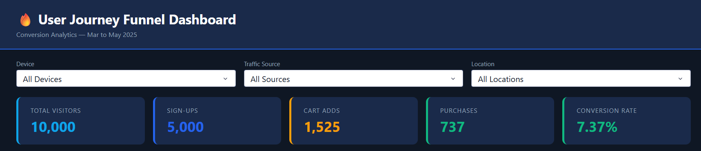
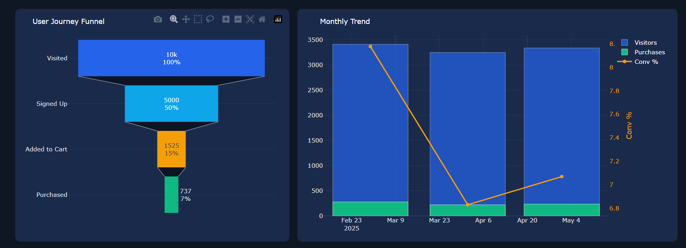
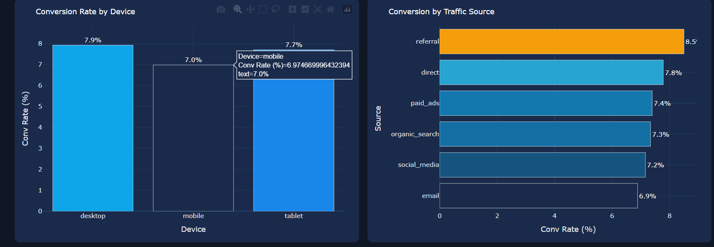
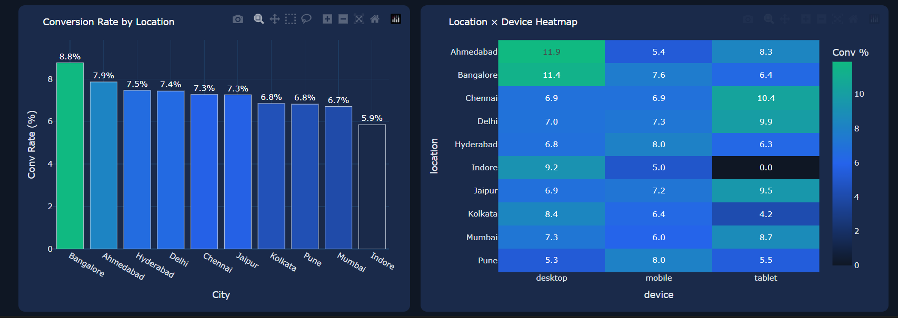

# 📊 User Journey Funnel Analysis

Analyze user behavior across a conversion funnel using Python, exploratory data analysis (EDA), interactive visualizations, and automated reporting.

---

## 🎯 Project Overview

This project explores the user journey from initial website visit to final purchase. The goal is to identify conversion bottlenecks, understand user behavior patterns, and generate actionable business insights for improving funnel performance.

Key areas analyzed:

* Funnel conversion performance
* User drop-off analysis
* Device-wise behavior
* Traffic source effectiveness
* Monthly conversion trends
* Business KPI tracking

---

## 🛠️ Technologies Used

* Python
* Pandas
* NumPy
* Plotly
* Jupyter Notebook
* HTML Reporting

---

## 📂 Repository Structure

```text
user-journey-funnel-analysis/
│
├── dashboard-images/
│   ├── img1.png
│   ├── img2.png
│   ├── img3.png
│   └── img4.png
│
├── data/
│   └── user_data_updated.csv
│
├── output/
│   ├── chart_device.png
│   ├── chart_funnel.png
│   ├── chart_heatmap.png
│   ├── chart_traffic.png
│   └── funnel_analysis_report.pdf
│
├── analysis.ipynb
├── funnel_report.html
└── README.md
```

---

## 📈 Key Metrics

| Metric          | Value  |
| --------------- | ------ |
| Total Visitors  | 10,000 |
| Sign-Ups        | 5,000  |
| Cart Adds       | 1,525  |
| Purchases       | 737    |
| Conversion Rate | 7.37%  |

---

## 📊 Dashboard Preview

### KPI Overview



### Funnel Analysis



### Conversion Insights



### Traffic & Device Analysis



---

## 🔍 Analysis Performed

### Funnel Analysis

* Visitor-to-signup conversion
* Signup-to-cart conversion
* Cart-to-purchase conversion
* Drop-off identification

### Device Analysis

* User distribution by device
* Device performance comparison

### Traffic Source Analysis

* Source-wise traffic contribution
* Conversion effectiveness by source

### Trend Analysis

* Monthly visitor trends
* Purchase trends
* Conversion rate tracking

---

## 📄 Outputs

* Interactive HTML Dashboard
* PDF Business Report
* Funnel Visualizations
* KPI Summary Dashboard
* Business Insights

---

## 🚀 How to Run

Clone the repository:

```bash
git clone https://github.com/ayushdwd00/user-journey-funnel-analysis.git
```

Install dependencies:

```bash
pip install pandas numpy plotly
```

Launch Jupyter Notebook:

```bash
jupyter notebook analysis.ipynb
```

---

## 💡 Business Insights

* Significant user drop-off occurs between Sign-Up and Cart stages.
* Conversion rate stands at 7.37%.
* Funnel analysis helps identify optimization opportunities.
* Traffic and device segmentation reveal high-performing channels.

---

## 👨‍💻 Author

**Ayush Dwivedi**

Aspiring Data Analyst | Python | SQL | Power BI | Data Visualization
